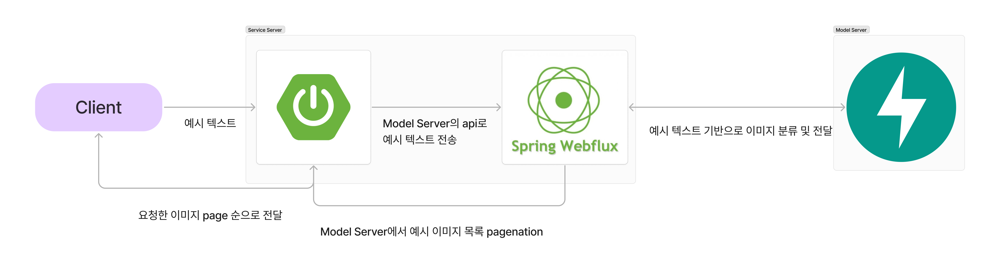
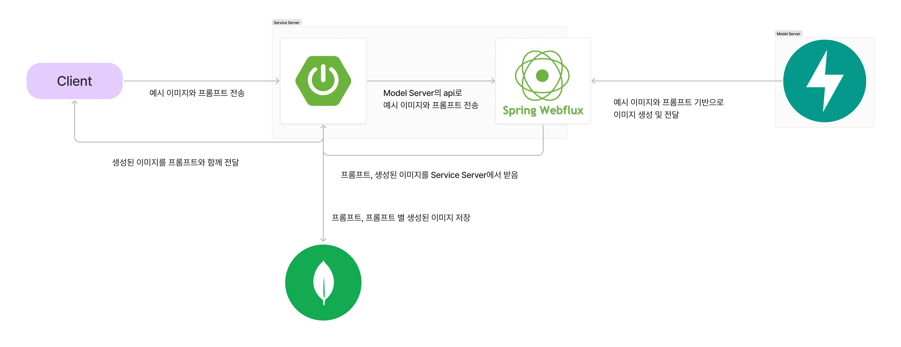

# Style Transfer
## 프로젝트 소개
텍스트 기반 생성 모델을 사용하여 이야기에 대한 삽화를 만드는 연구를 진행(인공지능 모델 연구)  
그리고 연구한 모델을 바탕으로 누구나 쉽게 이를 사용할 수 있도록 서비스를 구축
## 기능 소개
### 예시 이미지

- 클라이언트에서 입력한 텍스트를 GPT api를 통해서 단축
- 단축된 텍스트를 기반으로 가중치를 측정하고,  Model Server의 file system에 저장된 이미지를 가중치를 기준으로 분류
- 분류된 이미지 중 가중치에 가장 가까운 상위 500개의 이미지를 Service Server로 전송

### 이미지 생성

- 클라이언트에서 선택한 예시 이미지 및 프롬프트들을 Model Server로 전달
- Model Server는 Initalize한 이미지 생성 모델을 기반으로 각 프롬프트에 맞는 이미지를 내용이 연결되도록 생성
- 프롬프트와 그 프롬프트로 생성된 이미지를 클라이언트에 전송함과 동시에 Nosql DB에 저장